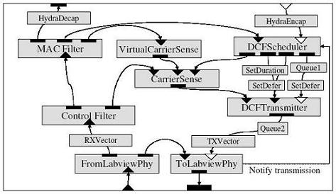
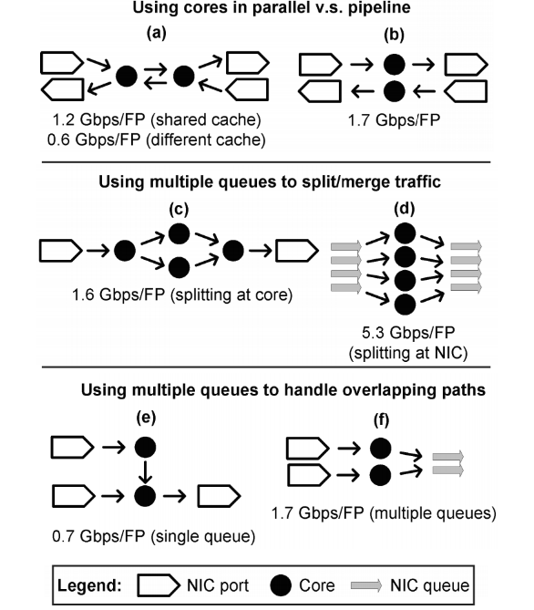
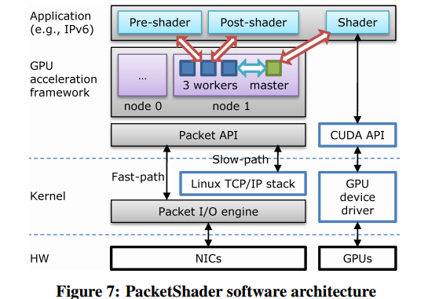
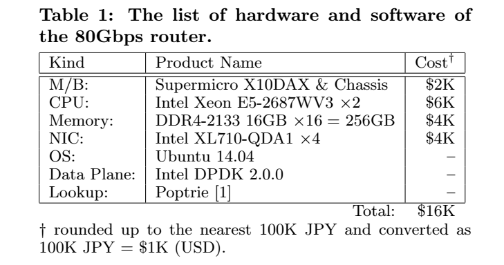
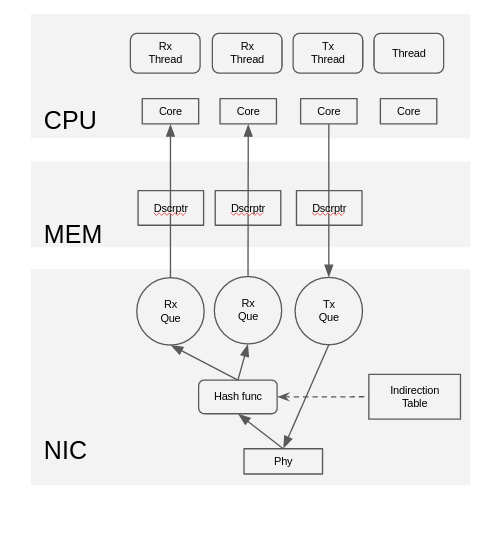
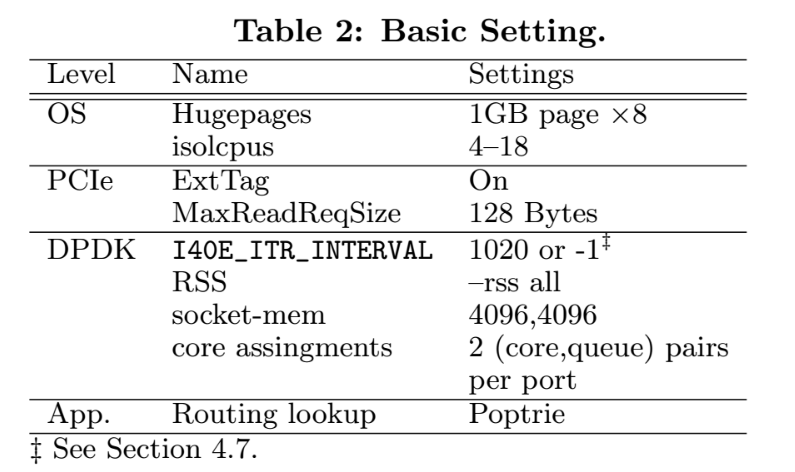
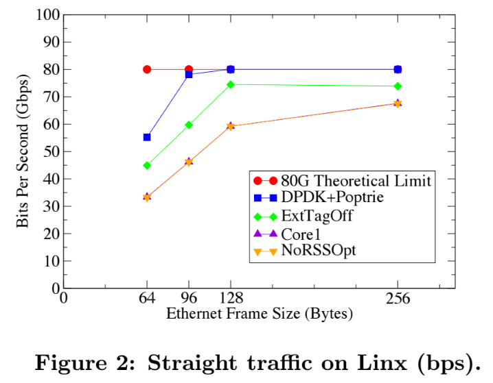
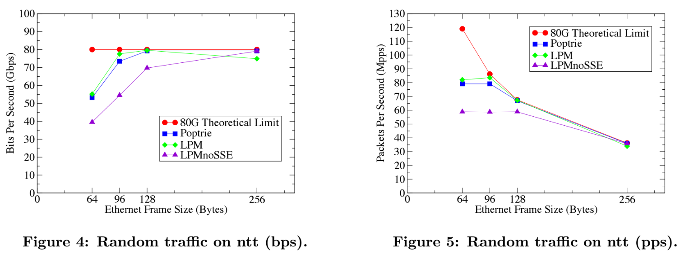
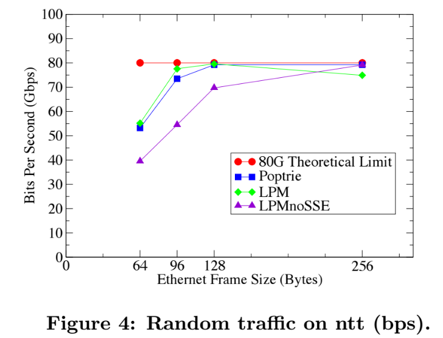

class: center, middle


# Revealing the Necessary Conditions to Achieve 80Gbps High-Speed PC Router

Yasuhiro Ohara (NTT Com) <br>
Yudai Yamagishi (NTT Com) <br>
Satoshi Sakai (NTT Com) <br>
Abhik Datta Banik (NTT Com) <br>
Shin Miyakawa (NTT Com) <br>

AINTEC'15 (Asian Internet Engineering Conference)

## Hiroki SHIROKURA @slankdev

---
# 背景

汎用HWでの高性能化は終わりのない疑問として残る

- **IndustrialではCOTSデバイスとしてカウントされていないHWがある<br>
  これらの技術的詳細が明らかになっていない**
- **研究分野ではCOTSデバイスのみでの限界性能がフォーカスされていない**

本稿での内容
- 80Gbpsを達成するPCルータをCOTSデバイスの最適な設定で実現
- 500K BGP Full route 128B 80Gbpsを達成
- 高性能なルーティングアルゴリズムPoptrie

COTS: commercial off-the-shelf  製品版、一般向け提供されているもの


---
# Introduction

高速データ通信とパケット処理能力の需要は年々あがる。
データリンクの速度も10GE,40GbE,100GbEとどんどん増加している

- スケールアウトアプローチ
- COTSデバイスは低コスト
- 00K個のCOTSデバイスはデータセンタにおかれ、ソフトウェア制御
- 100GbE ショートパケット処理性能を汎用HWで制御
	- DPDK
	- Netmap
- 本稿では100GbEを達成するPCルータを取り組むプロジェクト
  - Poptrieによるルーティング100GbE達成


---
# Index

1. Related Work
2. Impact of High-speed Software Router Technology
3. How to Construct the 80Gbps PC Router
4. Evaluation
5. Conclusion

ここからが本題


---
# Index

1. **Related Work**
2. Impact of High-speed Software Router Technology
3. How to Construct the 80Gbps PC Router
4. Evaluation
5. Conclusion


---
# Related Work

- Click (Click Moduler Router) 4.95Mpps
- RouteBricks 35Gbps
- Packet Shader 39,28Gbps for IPv4,v6 (64B)
- Click OS
- Radisys 80Gbps (no routing)


---
# Click (ACM'2000 TOCS)
	- configuable flexible software router 現代のベースになる
	- ルータやスイッチ = { Match, Action, Dataflow, Queuing }という考え

<div align="center">

</div>


---
# RouteBricks (ACM'09 SOSP)

- Multi Core CPU Multi Queue NIC

<div align="center">

</div>


---
# Packet Shader (SIGCOMM'10)

- GPU for packet processing
- Optimize packet I/O by incorporating enhance packet buffer
- Points
	- Parallel hw proccess
	- NUMA Multiple Core CPU

<div align="center">

</div>


---
# Click OS
	- Xen based VM router for NFV
	- Hundreds of middleboxes concurerently con COTS hardware
	- vely low latency
	- fast bootup
	- click environmentを使用
	- Click の原則を継承

# Radisys
  - packet forward only
	- no routing
	- special board


---
# Index

1. Related Work
2. **Impact of High-speed Software Router Technology**
3. How to Construct the 80Gbps PC Router
4. Evaluation
5. Conclusion


---
# Impact of High-speed SW Router Technology

- ASIC, FPGAが市場を支配している
- 汎用PCで専用HW並みの性能を出すと
- 1 million USD -> 100K USD以下 (1,000,000,00円 -> 100,000,00円以下)
- CAPEX OPEX 両方ダウン
- Open Sourceにすればだれでもextend, debugもできるようになる

より詳しくは以下を参照
http://slankdev.hatenablog.com/entry/2017/05/06/041354


---
# Index

1. Related Work
2. Impact of High-speed Software Router Technology
3. **How to Construct the 80Gbps PC Router**
4. Evaluation
5. Conclusion


---
# How to Construct the 80Gbps PC router

1. Hardware and Sftware
2. RSS Configuration
3. Number of (CPU Cores, NIC Queue) Pairs
4. Hugepage Memory
5. PCI Flags: extended tag and max\_read\_request\_size
6. isolCPUs
7. Intel DPDK Configuration
8. Routing Lookup Algorithms

---
# Hardware and Sftware



$16K = 1600000Yen = 160万円

---
# 補足: RSS(Receive Side Scaling)

<div align="center">

</div>


---
# RSS Configuration

```
(ETH_RSS_IP | ETH_RSS_TCP | ETH_RSS+UDP | ETH_RSS_SCTP | ETH_RSS_L2_PAYLOAD)
```

- RSS was necessary to achive 40Gbps wire-rate
- ETH\_RSS\_IP is not working ... ?


---
# Number of (CPU Cores, NIC Queue) Pairs

```clang
--config '(0,0,4),(0,1,5),(1,0,6),(1,1,7),(2,0,10),(2,1,11),(3,0,12),(3,1,13)'
```

- 各portにQueueを2つ用意
- それぞれのQueueに一つのCPUを割り当てる
- 合計8コア用意する


---
# Hugepage Memory

Hugepageはユーザ空間の1pageを大きく確保することによりpage missを軽減する技術
である。DPDKから叩くことができる. 1MB,1GBどちらも良好に動作をした。
今回はデフォルトで1GBのHugepagesを使用する。

```clang
"default_hugepagesz=1G hugepagesz=1G hugepages=8"
--socket-mem 4096, 4096
```

- DPDK sample program, l3fwd accept the option "-socket-mem"
- 我々はよくこれを使用する

それぞれのNUMA nodeに4096MBずつメモリを割り当てる内容

```clang
--socket-mem 1, 1
```

でも性能劣化がなく使用することができたらしい。。。
必要なものは1G HugepagesだけっぽいがDPDKの問題かもしれない.


---
# PCI Flags: extended tag and max\_read\_request\_size

- Extended tag flag of PCIe spec
- 拡張tagの設定bitを指定する
- mac read request size はデフォでは最大値になっている
- 128 ~ 4096Bだがとくに変化はなかった。
- なので本研究では128Bに指定

```clang
setpci -s <PCIeBusID> A8.W=12F
```

DPDk Config

```clang
CONFIG_RTE_PCI_CONFIG=y
CONFIG_RTE_PCI_EXTENDED_TAG="on"
```


---
# isolCPUs

OSのスケジューラから切り離す機構である。
PMDはbusy-loopでずっと回りつづけるためisolateが必要
4-18をisolate するように設定する.

- isolcpusで性能変化は見られなかった。

```clang
isolcpus=4-18
```

---
# Intel DPDK Configuration

```clang
CONFIG_RTE_LIBRTE_I40E_16BYTE_RX_DESC=y
CONFIG_RTE_LIBRTE_I40E_ITR_INTERVAL=1020
```

これから以下のみ変更した。

```clang
CONFIG_RTE_LIBRTE_I40E_ITR_INTERVAL=-1
```
無効っていみかな？

Fig2,3はinterval=1020で計測を行った。


---
# Routing Lookup Algorithms

以下を比較

- LPM
- LPM noSSE
- Poptrie

l3fwdでLPMが提供されている.

- DPDK LPM support only 1024 routes for the total number of routes
- librte\_lpm supports only 256 /24 ranges for the number of prefixes whose
  length is more than /24
- Modifiy it to support rtable with extended number of routes

```clang
- #define IPV4_L3FWD_LPM_MAX_RULES 1024
+ #define IPV4_L3FWD_LPM_MAX_RULES 1048576
- #define RTE_LPM_TBL8_NUM_GROUPS  256
+ #define RTE_LPM_TBL8_NUM_GROUPS  (256*256*8)
```

- Poptrie adopt l3fwd


---
# Index

1. Related Work
2. Impact of High-speed Software Router Technology
3. How to Construct the 80Gbps PC Router
4. **Evaluation**
5. Conclusion


---
# Evaluation

Eval環境についての説明
- Network Configuration
- Routing Table
- Traffic Pattern
- Basic Setting Summary

実験結果の評価
- Conparison of parameters
- NUMA Position
- LPM vs Poptrie


---
# Network Configuration


- IXIA
- pktgen-dpdk
- place routing engine each cores (QPI is slow: 9.6GT/s)


---
# Routing Table

- linx
	- GBP full route
	- 2014/12/17
	- 518231 routes
- ntt
	- international backbone
	- 2015/1/9
	- 531489 routes

- ntt used in the readl field,
- with 16,140 routes.
- that is longer than /24

Thre next-hop field of all routeing-tables were set to the port ID.(round robin)


---
# Traffic Pattern

- straight
- cross-cpus
- random

それぞれ以下のような場合を言う.


---
# Basic Setting Summary



次SectionからResultがある


---
# Conparison by parameters

- Core1, NoRSSOptの比較 (RSSしていないという同じ状態)
- (core, queue) pairの数の問題であることがわかる
- 5 times average

```clang
Core1 --config '(0,0,4),(1,0,6),(2,0,10),(3,0,12)'
```

<!--  -->
<div align="center">

</div>


---

# NUMA Position

これにかんしては違いが現れず.
100GbE程度では関係がないっぽい


---
# LPM vs Poptrie


<!--  -->
<div align="center">

</div>


---
# Index

1. Related Work
2. Impact of High-speed Software Router Technology
3. How to Construct the 80Gbps PC Router
4. Evaluation
5. **Conclusion**


---
# Conclusion and Future work

- Implementation of a PC base high-speed software router
- Achieve 80Gbps
- Can act as a high speed router
- Reasonable cost


---
# 寝ている人

<div align="center">

</div>


