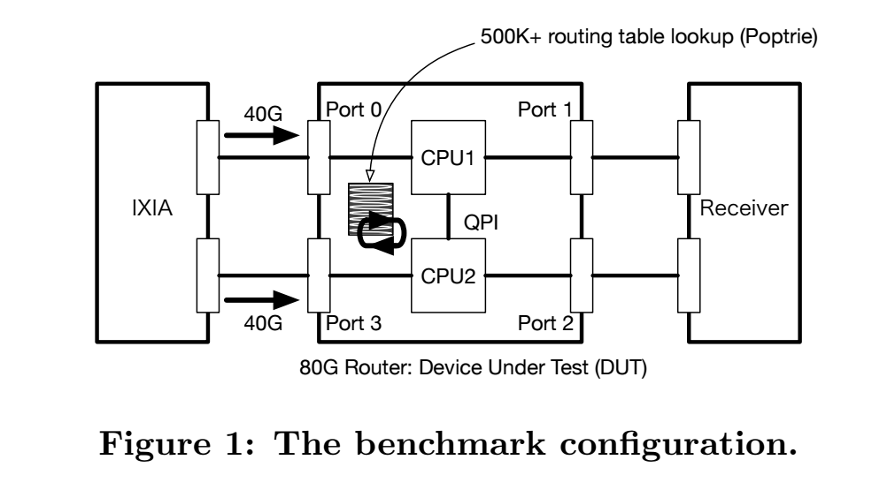
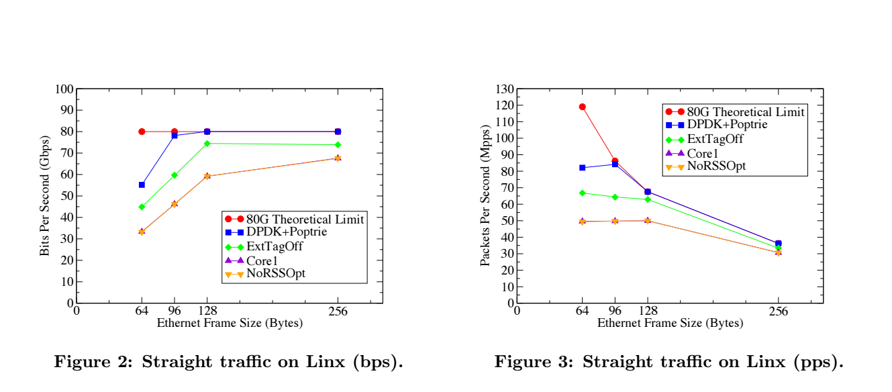

class: center, middle


# Revealing the Necessary Conditions to Achieve 80Gbps High-Speed PC Router

- Yasuhiro Ohara (NTT Com)
- Yudai Yamagishi (NTT Com)
- Satoshi Sakai (NTT Com)
- Abhik Datta Banik (NTT Com)
- Shin Miyakawa (NTT Com)

AINTEC'15 (Asian Internet Engineering Conference)

---
# 背景

PCとCOTSデバイスでの高性能化は終わりのない疑問として残る

- IndustrialではCOTSデバイスとしてカウントされていないHWがある
  技術的詳細が明らかになっていない
- 研究分野ではCOTSデバイスのみでの限界性能がフォーカスされていない

本研究では80Gbpsを達成するPCルータをCOTSデバイスの最適な設定で実現する。
500K BGP Full route 128B 80Gbpsを達成する
高性能なルーティングアルゴリズムであるPoptrieを用いて

COTS: commercial off-the-shelf  製品版、一般向け提供されているもの

---
# Introduction

高速データ通信とパケット処理能力の需要は年々あがる。
データリンクの速度も10GE,40GbE,100GbEとどんどん増加している

- スケールアウトアプローチ
- COTSデバイスはそれに最適に製造されている値段的コストも低い
- 100KのCOTSデバイスはデータセンタにおかれ、ソフトウェアにDriveされている
- 100GbEクラスショートパケット処理性能をCommodity HWで扱うのも近年進んでいる
	- DPDK
	- Netmap
- 我々は100GbEを達成するPCルータを取り組む
  - Poptrieによるルーティングはできるようになった。

---
# Related Work

- Click (Click Moduler Router)
- RouteBricks
- Packet Shader
- Click OS


---
# Radisys
  - packet forward only
	- no routing
	- 80Gbps with DPDK x86


---
# Click (Click Moduler Router)
	- detail
		- configuable
		- flexible
		- software router
  - apprortions
		- router function like a queuing
		- 現代のベースになる
	- 4.95Mpps

---
# RouteBricks
	- click environmentを使用
	- COTSデバイス
	- 35Gbpsまで上昇
	- Points
		- Multi Core CPU
		- Multi Queue NIC

---
# Packet Shader
	- Highperformance Soft Router
	- GPU for packet processing
	- paralllel procesing power of GPU
	- Optimize packet I/O by incorporating enhance packet buffer
	- Points
		- Parallel hw proc
		- NUMA
		- Mutiple Core CPU
	- 39Gbps for IPv4 (64B)
	- 38Gbps for IPv6 (64B)

---
# Click OS
	- Xen based VM router for NFV
	- Hundreds of middleboxes concurerently con COTS hardware
	- vely low latency
	- fast bootup
	- Click の原則を継承

---
# Radisys
  - packet forward only
	- no routing
	- 80Gbps with DPDK x86
	- special board

---
# Impact of High-speed SW Router Technology

- ASIC, FPGAが市場を支配している
- コストダウン
- capex opexダウン
- reducable generic pc
- Open Sourceにすればextend, debugもできるようになる, まわりが

---
# How to Construct the 80Gbps PC router

1. Hardware and Sftware
2. RSS Configuration
3. Number of (CPU Cores, NIC Queue) Pairs
4. Hugepage Memory
5. PCI Flags: extended tag and max\_read\_request\_size
6. isolCPUs
7. Intel DPDK Configuration
8. Routing Lookup Algorithms

---
# Hardware and Sftware

 Kind       | Product Name                | Cost
 -----------|-----------------------------|-------
 M/B        | Supermicro X10DAX &amp; Chassis | $2K
 CPU        | Intel Xeon E5-2687WV3 x 2   | $6K
 Mem        | DDR4-2133 16GB x 16 = 256GB | $4K
 NIC        | Intel XL710-QDA1 x 4        | $4K
 OS         | Ubuntu 14.04 LTS            | -
 Data plane | Intel DPDK 2.0.0            | -
 Lookup     | Poptrie                     | -

---
# RSS Configuration

```
(ETH_RSS_IP | ETH_RSS_TCP | ETH_RSS+UDP | ETH_RSS_SCTP | ETH_RSS_L2_PAYLOAD)
```

- RSS was necessary to achive 40Gbps wire-rate
- ETH\_RSS\_IP is not working ... ?


---
# Number of (CPU Cores, NIC Queue) Pairs

```clang
--config '(0,0,4),(0,1,5),(1,0,6),(1,1,7),(2,0,10),(2,1,11),(3,0,12),(3,1,13)'
```

実験後の理解としてCore1は各portに1つのペアが指定されたことを示す.????

```clang
--config '(0,0,4),(1,0,6),(2,0,10),(3,0,12)'
```


---
# Hugepage Memory

Hugepageはユーザ空間の1pageを大きく確保することによりpage missを軽減する技術
である。DPDKから叩くことができる. 1MB,1GBどちらも良好に動作をした。
今回はデフォルトで1GBのHugepagesを使用する。

```clang
"default_hugepagesz=1G hugepagesz=1G hugepages=8"
--socket-mem 4096, 4096
```

- DPDK sample program, l3fwd accept the option "-socket-mem"
- 我々はよくこれを使用する

それぞれのNUMA nodeに4096MBずつメモリを割り当てる内容

```clang
--socket-mem 1, 1
```

でも性能劣化がなく使用することができたらしい。。。
必要なものは1G HugepagesだけっぽいがDPDKの問題かもしれない.


---
# PCI Flags: extended tag and max\_read\_request\_size

- Extended tag flag of PCIe spec
- 拡張tagの設定bitを指定する
- mac read request size はデフォでは最大値になっている
- 128 ~ 4096Bだがとくに変化はなかった。
- なので本研究では128Bに指定

```clang
set pci -s <PCIeBusID> A8.W=12F
```

DPDk Config

```clang
CONFIG_RTE_PCI_CONFIG=y
CONFIG_RTE_PCI_EXTENDED_TAG="on"
```
---
# isolCPUs

OSのスケジューラから切り離す機構である。
PMDはbusy-loopでずっと回りつづけるためisolateが必要
4-18をisolate するように設定する.

- isolcpusで性能変化は見られなかった。

```clang
isolcpus=4-18
```


---
# Intel DPDK Configuration

```clang
CONFIG_RTE_LIBRTE_I40E_16BYTE_RX_DESC=y
CONFIG_RTE_LIBRTE_I40E_ITR_INTERVAL=1020
```

これから以下のみ変更した。

```clang
CONFIG_RTE_LIBRTE_I40E_ITR_INTERVAL=-1
```
無効っていみかな？

Fig2,3はinterval=1020で計測を行った。


---
# Routing Lookup Algorithms

以下を比較

- LPM
- LPM noSSE
- Poptrie

l3fwdでLPMが提供されている.

- DPDK LPM support only 1024 routes for the total number of routes
- librte\_lpm supports only 256 /24 ranges for the number of prefixes whose
  length is more than /24
- Modifiy it to support rtable with extended number of routes

```clang
- #define IPV4_L3FWD_LPM_MAX_RULES 1024
+ #define IPV4_L3FWD_LPM_MAX_RULES 1048576
- #define RTE_LPM_TBL8_NUM_GROUPS  256
+ #define RTE_LPM_TBL8_NUM_GROUPS  (256*256*8)
```

- Poptrie adopt l3fwd

---
# Evaluation


---
# Network Configuration



- IXIA
- pktgen-dpdk
- place routing engine each cores (QPI is slow: 9.6GT/s)


---
# Routing Table

- linx
	- GBP full route
	- 2014/12/17
	- 518231 routes
- ntt
	- international backbone
	- 2015/1/9
	- 531489 routes

- ntt used in the readl field,
- with 16,140 routes.
- that is longer than /24

Thre next-hop field of all routeing-tables were set to the port ID.(round robin)


---
# Traffic Pattern

- straight
- cross-cpus
- random

それぞれ以下のような場合を言う.

---
# Basic Setting Summary

Table2: Basic Setting

Level  | Name                | Settings
-------|---------------------|-------------------
OS     | Hugepages           | 1GB page x8
       | isolcpus            | 4-18
PCIe   | ExtTag              | On
       | MaxReadReqSize      | 128 Bytes
DPDK   | I40E\_ITR\_INTERVAL | 1020 or -1
       | RSS                 | -rss all
       | socket-mem          | 4096, 4096
       | core assignments    | 2 (core, queue) pairs/port
App    | Routing lookup      | Poptrie

次SectionからResultがある

---
# Conparison by parameters

- DPDK+Poptrie: 128B 80Gbps
- Core1, NoRSSOptの比較 (RSSしていないという同じ状態)
- (core, queue) pairの数の問題であることがわかる
- traffic: **straight**, routgin table: **linx**
- 5 times average




---
# Cross CPU Traffic

これにかんしては違いが現れず。より広帯域になったときにどうなるかに注目したい


---
# LPM vs Poptrie

---
# Conclusion and Future work

- Described the implementation of a PC base high-speed software router which can schieve 80Gbps
- PC can act as a high speed trouter for quite reasonable cost


---
# Reference
# Memo


---
"thre experiment result is omitted in this paper"が多いのはまあ仕方ないか
